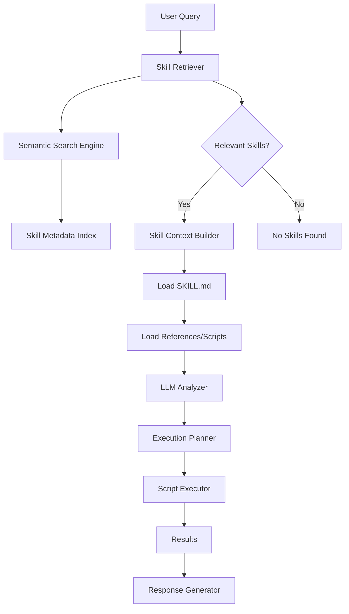

# Agent Skills Framework

A progressive skill loading framework for LLM agents that enables dynamic skill discovery, retrieval, and execution based on user queries.

## Table of Contents
- [Overview](#overview)
- [Technical Architecture](#technical-architecture)
- [Key Features](#key-features)
- [Installation](#installation)
- [Quick Start](#quick-start)
- [Advanced Usage](#advanced-usage)
- [Skill Structure](#skill-structure)
- [API Reference](#api-reference)

## Overview

The Agent Skills Framework implements a three-level progressive context loading mechanism that efficiently manages skill discovery and execution:

1. **Level 1 (Metadata)**: Load all skill names and descriptions
2. **Level 2 (Main Instructions)**: Load SKILL.md when relevant to a query
3. **Level 3+ (Resources)**: Load additional files only when referenced

This approach minimizes resource consumption while providing comprehensive skill capabilities.

## Technical Architecture



### Core Components

| Component | Description |
|-----------|-------------|
| `AgentSkill` | Main agent class implementing progressive loading |
| `SkillLoader` | Loads and manages skill definitions |
| `Retriever` | Finds relevant skills using semantic search |
| `SkillContext` | Builds execution context for skills |
| `ScriptExecutor` | Safely executes skill scripts |

## Key Features

### Progressive Context Loading
- **Efficient Resource Usage**: Only loads necessary files when needed
- **Scalable Design**: Supports hundreds of skills without performance degradation
- **Dynamic Discovery**: Automatically discovers new skills in directories

### Multi-Level Skill Execution
- **Level 1 - Metadata**: Fast skill identification
- **Level 2 - Instructions**: Detailed skill documentation
- **Level 3+ - Resources**: Implementation files and references

### Secure Script Execution
- **Sandbox Environment**: Optional isolated execution environment
- **Package Management**: Automatic dependency installation
- **Timeout Protection**: Prevents hanging processes

### Flexible Skill Structure
- **Standard Format**: Consistent skill definition structure
- **Multiple File Types**: Support for documentation, scripts, and resources
- **Extensible Design**: Easy to add new skill types

## Installation

### Prerequisites
- Python 3.8+
- pip package manager

### Install from PyPI
```bash
pip install agent-skills
```

### Install from Source
```bash
git clone <repository-url>
cd agent-skills
pip install -r requirements.txt
```

### Environment Variables
```bash
export OPENAI_API_KEY="your-api-key"
export OPENAI_BASE_URL="custom-base-url"  # Optional
```

## Quick Start

### Basic Usage

```python
from agent_skill import create_agent

# Create agent with default settings
agent = create_agent(
    skill_path="skills",
    model="gpt-4"
)

# Run a query
response = agent.run("Create a DCF financial model for a tech company")
print(response)
```

### Simple Skill Creation
Create a new skill directory with this structure:
```
skills/
└── my-new-skill/
    ├── SKILL.md
    ├── reference.md
    └── scripts/
        └── implementation.py
```

SKILL.md example:
```markdown
---
name: "My New Skill"
description: "A brief description of what this skill does"
tags: ["category1", "category2"]
author: "Your Name"
version: "1.0.0"
---

# My New Skill

Detailed instructions on how to use this skill...

## Usage Examples

1. First example...
2. Second example...
```

## Advanced Usage

### Custom Agent Configuration
```python
from agent_skill import AgentSkill

agent = AgentSkill(
    skills="./skills",           # Path to skills directory
    model="gpt-4",              # LLM model
    api_key="your-api-key",     # OpenAI API key
    base_url="custom-url",      # Custom API endpoint
    stream=True,                # Stream responses
    working_dir="./work",       # Working directory
    use_sandbox=False           # Enable sandbox execution
)
```

### Working with Multiple Skills
```python
# Load specific skills by path
agent = create_agent([
    "./skills/financial-modeling",
    "./skills/data-analysis"
])

# Load all skills in directory
agent = create_agent("./skills")
```

### Custom Skill Execution
```python
# Get relevant skills for a query
relevant_skills = agent.retriever.retrieve("financial analysis")

# Manually build context for a skill
skill_context = agent._build_skill_context(skill)

# Execute a specific script
result = agent.execute(
    code_block={
        "script": "scripts/analyze.py",
        "parameters": {"company": "ABC Corp"}
    },
    skill_context=skill_context
)
```

## Skill Structure

### Directory Layout
```
skill-name/
├── SKILL.md              # Main skill definition
├── reference.md          # Detailed reference material
├── LICENSE.txt           # License information
├── resources/            # Additional resources
│   ├── template.xlsx     # Example files
│   └── data.json         # Data files
└── scripts/              # Executable scripts
    ├── main.py           # Main implementation
    └── helper.py         # Helper functions
```

### SKILL.md Format
```markdown
---
name: "Skill Name"
description: "Brief description of the skill"
tags: ["tag1", "tag2", "tag3"]
author: "Author Name"
version: "1.0.0"
dependencies: ["numpy", "pandas"]
---

# Skill Title

Detailed explanation of what the skill does...

## Key Features

- Feature 1
- Feature 2
- Feature 3

## Usage

Instructions on how to use this skill...

## Examples

```
Example usage code
```
```

### Script Execution Format
Scripts should follow this pattern for automatic execution:
```python
# Example script with parameters
import sys
import json

def main(company_name, years=5):
    # Implementation here
    result = {"company": company_name, "valuation": 1000000}
    print(json.dumps(result))

if __name__ == "__main__":
    # Parse parameters from command line
    company_name = sys.argv[1] if len(sys.argv) > 1 else "Default Corp"
    years = int(sys.argv[2]) if len(sys.argv) > 2 else 5
    main(company_name, years)
```

## API Reference

### AgentSkill Class

| Method | Description | Parameters |
|--------|-------------|------------|
| `__init__` | Initialize the agent | skills, model, api_key, base_url, stream, working_dir, use_sandbox |
| `run(query)` | Execute a query using skills | query (str) |
| `execute(code_block, skill_context)` | Execute a specific script | code_block (dict), skill_context (SkillContext) |
| `_build_skill_context(skill)` | Build execution context | skill (SkillSchema) |

### Helper Functions

| Function | Description | Parameters |
|----------|-------------|------------|
| `create_agent()` | Create agent instance | skill_path, api_key, base_url, model, stream, working_dir |

### Configuration Options

| Option | Default | Description |
|--------|---------|-------------|
| `stream` | True | Stream LLM responses |
| `use_sandbox` | False | Use isolated execution environment |
| `working_dir` | Current directory | Directory for file operations |
| `max_tokens` | 8192 | Maximum tokens for LLM responses |

### Environment Variables

| Variable | Description |
|----------|-------------|
| `OPENAI_API_KEY` | OpenAI API key for LLM access |
| `OPENAI_BASE_URL` | Custom API endpoint (optional) |

## Contributing

1. Fork the repository
2. Create a feature branch
3. Add your skill or improvement
4. Write tests if applicable
5. Submit a pull request

## License

This project is licensed under the MIT License - see the [LICENSE](LICENSE) file for details.
