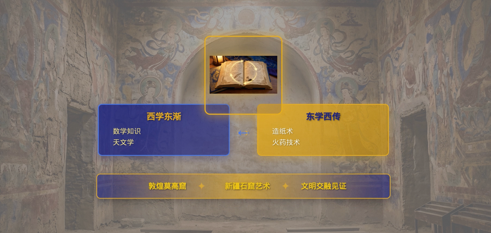

# SingularityCinema

A lightweight short-video generator: it uses large language models to generate a **script and storyboard**, then automatically produces **voice-over / (optional) subtitles / images / (optional) text-to-video**, and finally composes them into a short video.

---

## Showcase

[](http://modelscope.oss-cn-beijing.aliyuncs.com/ms-agent/show_case/video/deploy_llm_claude_sonnet_4_5_mllm_gemini_3_pro_image_gen_gemini_3_pro_image.mp4)
[](http://modelscope.oss-cn-beijing.aliyuncs.com/ms-agent/show_case/video/silu_claude_sonnet_4_5_mllm_gemini_3_pro_image_gen_gemini_3_pro_image.mp4)
[](http://modelscope.oss-cn-beijing.aliyuncs.com/ms-agent/show_case/video/en_deploy_llm_claude_sonnet_4_5_mllm_gemini_3_pro_image_gen_gemini_3_pro_image.mp4)

## Installation

This project requires both Python and Node.js.

1. **Environment setup**
   - **Python**: version >= 3.10. Using [Conda](https://docs.conda.io/projects/conda/en/stable/user-guide/install/index.html) to create a virtual environment is recommended.
   - **Node.js**: if you use the default Remotion engine to generate videos, you must install [Node.js](https://nodejs.org/) (recommended version >= 16).
   - **FFmpeg**: install [ffmpeg](https://www.ffmpeg.org/download.html#build-windows) and add it to your environment variables.

2. **Get the code**
   ```bash
   git clone https://github.com/modelscope/ms-agent.git
   cd ms-agent
   ```

3. **Install dependencies**
   ```bash
   pip install .
   cd projects/singularity_cinema
   pip install -r requirements.txt
   ```

---

## Compatibility and Limitations

SingularityCinema generates scripts and storyboards using LLMs and produces short videos.

### Compatibility
- Short video types: science popularization, economics (especially those involving charts/tables, formulas, and principle explanations)
- Languages: unlimited (subtitle and voice-over language follow your query and materials)
- External materials: supports reading plain text (does not support direct multimodal material input)
- Secondary development: the workflow can be found in `projects/singularity_cinema/workflow.yaml`; the core implementation is under `projects/singularity_cinema`,
  in each step’s `agent.py`, which can be extended and used commercially.
  - Please note and comply with the commercial licenses of background music, fonts, etc. that you use.

### Limitations
- The quality varies significantly across different LLM/AIGC models. It is recommended to use verified combinations and test on your own. The current default configuration can be found in `projects/singularity_cinema/agent.yaml`.

---

## Run

### 1) Prepare API Keys

**Prepare an LLM key**

Using Gemini as an example, you need to apply for or purchase access to Gemini models. Runtime parameters:
```shell
  --llm.openai_base_url https://generativelanguage.googleapis.com/v1beta/openai/ \
  --llm.model gemini-3-pro \
  --llm.openai_api_key {your_api_key_of_openai_base_url} \
```

**Prepare a text-to-image model key**

Using ModelScope’s Qwen/Qwen-Image-2512 as an example. ModelScope provides a small free quota per account daily. If you hit rate limits during high-frequency usage, simply rerun the same command to retry; it will resume from the failure point.
```shell
  --image_generator.api_key {your_modelscope_api_key} \
  --image_generator.type modelscope \
  --image_generator.model Qwen/Qwen-Image-2512 \
```

**Prepare a multimodal LLM for quality inspection**

Using Gemini as an example, you need to apply for or purchase access to Gemini models. Runtime parameters:
```shell
  --mllm_openai_base_url https://generativelanguage.googleapis.com/v1beta/openai/ \
  --mllm_openai_api_key {your_api_key_of_mllm_openai_base_url} \
  --mllm_model gemini-3-pro \
```

### 2) Prepare materials (optional)

You can generate a video with just one sentence, for example:
```text
Generate a short video describing GDP-related economics knowledge, about 3 minutes long.
```

You can also reference a local text file, for example:
```text
Generate a short video describing large-model technologies. Read /home/user/llm.txt for details.
```

---

### 3) Configuration Notes

The current default configuration is in `projects/singularity_cinema/agent.yaml`. At runtime, command-line arguments override the corresponding default parameters in the YAML. Specifically:

- If a field name is **unique** in the config, you can override it directly with the same-name argument, e.g.:
  - `--openai_api_key ...`
- If a field name is **not unique / conflicts** (e.g., multiple modules have `api_key`), you can specify it using a **multi-level path**, e.g.:
  - `--image_generator.api_key ...`
  - `--video_generator.api_key ...`

> Rule of thumb:
> - “Unique field” uses `--field`
> - “Nested / potentially conflicting field” uses `--a.b.c`

Relevant structure in the default YAML (excerpt):
```yaml
llm:
  model: claude-sonnet-4-5-20250929 # LLM model name (e.g., gemini-3-pro)
  openai_api_key: ""                # Required: API Key (provider key matching openai_base_url)
  openai_base_url: "https://dashscope.aliyuncs.com/compatible-mode/v1" # OpenAI-compatible Base URL (varies by provider)

mllm:
  mllm_model: gemini-3-pro-preview  # Multimodal model name (e.g., gemini-3-pro)
  mllm_openai_api_key: ""           # Required: multimodal model API Key
  mllm_openai_base_url: "https://dashscope.aliyuncs.com/compatible-mode/v1" # OpenAI-compatible Base URL for MLLM

image_generator:
  api_key: ""                       # Required: provider API Key
  type: dashscope                   # provider/platform type: modelscope | dashscope | google
  model: gemini-3-pro-image-preview # model ID/name supported by the selected type

video_generator:
  api_key: ""                       # provider API Key
  type: dashscope                   # modelscope | dashscope | google
  model: sora-2-2025-10-06          # video model ID/name supported by the selected type
```

---

### 4) Example Commands

Based on the default YAML, override key configurations for LLM / MLLM / text-to-image / text-to-video via the command line.

Below are the two examples used to generate the video previews on this page:
- Before running, replace `{path_to_ms-agent}` in the query with your local reference file path.
- Replace the `api_key` values with real API keys.

```bash
# For the English version, replace the query content with:
# "Convert /home/user/workspace/ms-agent/projects/singularity_cinema/test_files/J.部署.md
# into a short video in a blue-themed style, making sure to use the important images from the document.
# The short video must be in English."
ms-agent run --project singularity_cinema \
  --query "把/{path_to_ms-agent}/projects/singularity_cinema/test_files/J.部署.md转为短视频，蓝色风格，注意使用其中重要的图片" \
  --trust_remote_code true \
  --openai_base_url https://api.anthropic.com/v1/ \
  --llm.model claude-sonnet-4-5 \
  --openai_api_key {your_api_key_of_anthropic} \
  --mllm_openai_base_url https://generativelanguage.googleapis.com/v1beta/openai/ \
  --mllm_openai_api_key {your_api_key_of_gemini} \
  --mllm_model gemini-3-pro-preview \
  --image_generator.api_key {your_api_key_of_gemini} \
  --image_generator.type google \
  --image_generator.model gemini-3-pro-image-preview
```

```bash
ms-agent run --project singularity_cinema \
  --query "Please create a short video introducing the Silk Road, with a consistent visual style." \
  --trust_remote_code true \
  --openai_base_url https://api.anthropic.com/v1/ \
  --llm.model claude-sonnet-4-5 \
  --openai_api_key {your_api_key_of_anthropic} \
  --mllm_openai_base_url https://generativelanguage.googleapis.com/v1beta/openai/ \
  --mllm_openai_api_key {your_api_key_of_gemini} \
  --mllm_model gemini-3-pro-preview \
  --image_generator.api_key {your_api_key_of_gemini} \
  --image_generator.type google \
  --image_generator.model gemini-3-pro-image-preview
```

---

### 5) Output and Failure Retry

- The run typically takes about 20 minutes.
- The generated video is output to `output_video/` under your command execution directory (controlled by `--output_dir`) as `final_video.mp4`.
- If the run fails (timeout/interruption/missing files), you can rerun the command directly: the system will read execution info in `output_video` and resume from the breakpoint.
  - To regenerate from scratch: rename/delete the `output_video` directory.
  - To rerun only part of a storyboard: delete only the corresponding files for that segment; rerunning will execute only those segments.

---

## Technical Workflow

1. Generate a base script from user requirements
   - Input: user requirements; may read a user-specified file
   - Output: script file `script.txt`, original request file `topic.txt`, short-video title file `title.txt`
2. Split the script into storyboard segments
   - Input: `topic.txt`, `script.txt`
   - Output: `segments.txt`, a list of segments describing narration, background image generation requirements, and foreground Manim animation requirements
3. Generate audio narration for each segment
   - Input: `segments.txt`
   - Output: `audio/audio_N.mp3` list (N starts from 1), plus `audio_info.txt` in the root directory containing audio durations
4. Generate Remotion animation code based on audio duration
   - Input: `segments.txt`, `audio_info.txt`
   - Output: Manim code files `remotion_code/segment_N.py` (N starts from 1)
5. Fix Remotion code
   - Input: `remotion_code/segment_N.py` (N starts from 1), pre-error file `code_fix/code_fix_N.txt`
   - Output: updated `remotion_code/segment_N.py`
6. Render Remotion code
   - Input: `remotion_code/segment_N.py`
   - Output: `remotion_render/scene_N` folder list; if a segment includes Remotion requirements in `segments.txt`, the corresponding folder will contain `remotion.mov`
7. Generate text-to-image prompts
   - Input: `segments.txt`
   - Output: `illustration_prompts/segment_N.txt` (N starts from 1)
8. Text-to-image generation
   - Input: list of `illustration_prompts/segment_N.txt`
   - Output: list of `images/illustration_N.png` (N starts from 1)
9. Generate a background image (solid color) with the short-video title and slogans
    - Input: `title.txt`
    - Output: `background.jpg`
10. Compose the final video
    - Input: all files from previous steps. This step may take a long time with no logs and does not consume tokens.
    - Output: `final_video.mp4`

---

## Tunable Parameters (Overview)

Most parameters are in the default `agent.yaml`. Recommended practice: **do not modify the default YAML**; override what you need via command-line arguments.

Common examples:
- LLM/MLLM: `--openai_base_url`, `--openai_api_key`, `--llm.model`, `--mllm_model`, etc.
- Text-to-image / Text-to-video:
  - `--image_generator.type`, `--image_generator.model`, `--image_generator.api_key`
  - `--video_generator.type`, `--video_generator.model`, `--video_generator.api_key`
- Parallelism: `--t2i_num_parallel`, `--t2v_num_parallel`, `--llm_num_parallel`
- Video params: `--video.fps`, `--video.bitrate`, etc.
- Toggles: `--use_subtitle`, `--use_text2video`, `--use_doc_image`, etc.
